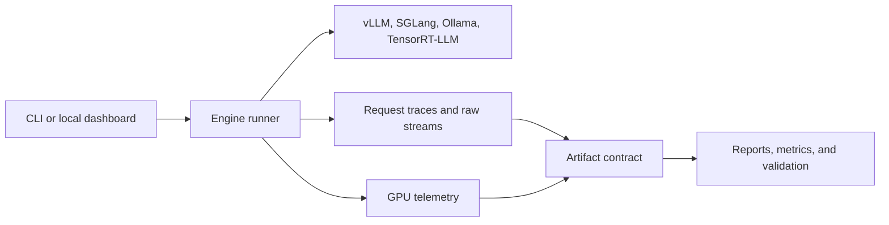

# Inferno

Inferno is a local-first toolkit for evaluating LLM serving engines with
artifact-backed evidence. It runs OpenAI-compatible model servers, captures
streaming traces and GPU telemetry, validates each run, and presents the results
through a Python CLI and a local browser dashboard.



## Features

- Real engine smoke runs with pinned Docker images and model revisions.
- Validated artifacts for manifests, request traces, raw streams, telemetry,
  summaries, checksums, and validation output.
- Strict vLLM/SGLang comparisons, deployment-profile reports, and
  engine-configuration reports.
- Offline capacity planning and serving-policy replay from existing artifacts.
- Local FastAPI + React dashboard for GPU preflight, benchmark runs, and
  artifact-backed metrics.

## Repository Layout

```text
src/inferno/             Python CLI, runners, validators, planners, dashboard API
web/dashboard/           React dashboard served by the local API
configs/                 Engine, workload, study, planner, router, and audit configs
docs/                    Methodology, reproducibility, and workflow notes
schemas/artifacts/       JSON schema snapshots for generated evidence
tests/                   CPU-safe test suite
artifacts/               Local generated outputs, ignored by Git
```

## Quick Start

Install Python dependencies:

```bash
uv sync --all-groups --frozen
```

Run tests and linting:

```bash
uv run pytest -q
uv run ruff check src tests
```

Build the dashboard:

```bash
cd web/dashboard
npm install
npm run build
```

Serve the dashboard locally:

```bash
PYTHONPATH=src uv run python -m inferno.cli dashboard --host 127.0.0.1 --port 8765
```

Run GPU preflight with a shell-provided target:

```bash
INFERNO_GPU_SSH="[operator supplied target]" PYTHONPATH=src uv run python -m inferno.cli doctor-gpu
```

## Dashboard Metrics

The dashboard derives metrics from generated artifacts:

- TTFT, TPOT, E2E p50/p95/p99, TPS, and request throughput
- configured and observed concurrency
- GPU utilization and VRAM usage from telemetry
- KV cache efficiency when the engine exposes cached token usage
- batching and scheduler efficiency as labeled proxies when native counters are
  unavailable

## Common Commands

```bash
make doctor
make test
make dashboard
PYTHONPATH=src uv run python -m inferno.cli dashboard --smoke --no-open
```

Generated runs, reports, and dashboard logs are written under `artifacts/`.
