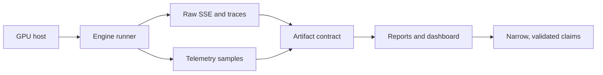
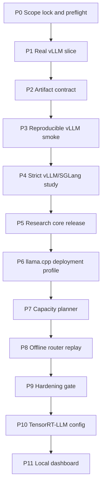
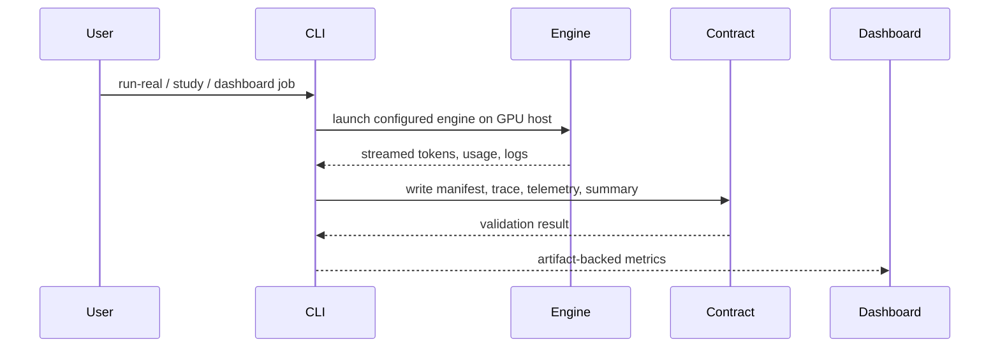

# Inferno

Inferno is a local-first inference evaluation workspace. It runs real model
serving engines, writes validation-backed artifacts, and keeps the claims narrow:
if a result is not backed by an artifact, it is not a result.

The current phase adds a local browser dashboard for operator-friendly GPU
smoke tests across vLLM, SGLang, Ollama, and TensorRT-LLM profiles. The older
phases remain in the repo because they explain how the evidence system grew.



## What This Repo Is

- A Python CLI for GPU preflight, engine smoke runs, studies, reports, replay,
  planning, validation, and dashboard serving.
- A React/Vite dashboard served locally by FastAPI.
- A set of phase records that separate strict engine evidence from deployment
  profile and engine-configuration evidence.
- A clean artifact contract for manifests, traces, telemetry, summaries, and
  validation results.

## What This Repo Is Not

- Not a public inference endpoint.
- Not a cloud control plane.
- Not a live router or autoscaler.
- Not a place to commit SSH targets, tokens, model weights, or private prompts.

## Phase Map



## Repository Layout

```text
src/inferno/             Python CLI, runners, validators, planners, dashboard API
web/dashboard/           Local React dashboard
configs/                 Engine, workload, study, planner, router, hardening configs
docs/                    Methodology, limitations, reproducibility, phase docs
.inferno/                Governance, contracts, policies, handoffs, phase state
tests/                   CPU-safe unit tests
artifacts/               Generated locally and ignored, except its README
```

## Artifact Flow



Generated artifacts belong under `artifacts/` and are intentionally ignored by
Git. Keep publishable evidence as redacted summaries, reports, configs, tests,
and phase records.

## Quick Start

Install Python dependencies:

```bash
uv sync --all-groups --frozen
```

Run the CPU-safe test suite:

```bash
uv run pytest -q
```

Run linting:

```bash
uv run ruff check src tests
```

Build the dashboard:

```bash
cd web/dashboard
npm install
npm run build
```

Serve the local dashboard:

```bash
PYTHONPATH=src uv run python -m inferno.cli dashboard --host 127.0.0.1 --port 8765
```

GPU runs need a runtime-only SSH target:

```bash
INFERNO_GPU_SSH="[operator supplied target]" PYTHONPATH=src uv run python -m inferno.cli doctor-gpu
```

Do not commit that value. The project policy expects it to come from your shell
or the dashboard form at runtime.

## Dashboard Metrics

The P11 dashboard reports metrics only when they can be derived from generated
artifacts:

- TTFT, TPOT, E2E p50/p95/p99, TPS, request throughput
- configured and observed concurrency
- GPU utilization and VRAM from telemetry
- KV cache efficiency when native engine usage exposes cached tokens
- batching and scheduler efficiency as labeled proxies when native counters are
  not available

## Useful Commands

```bash
make doctor
make test
make dashboard
PYTHONPATH=src uv run python -m inferno.cli dashboard --smoke --no-open
```

## Publishing Notes

This clean copy omits generated run artifacts, virtual environments, caches,
dashboard build output, and installed Node modules. Recreate those locally with
the commands above.
